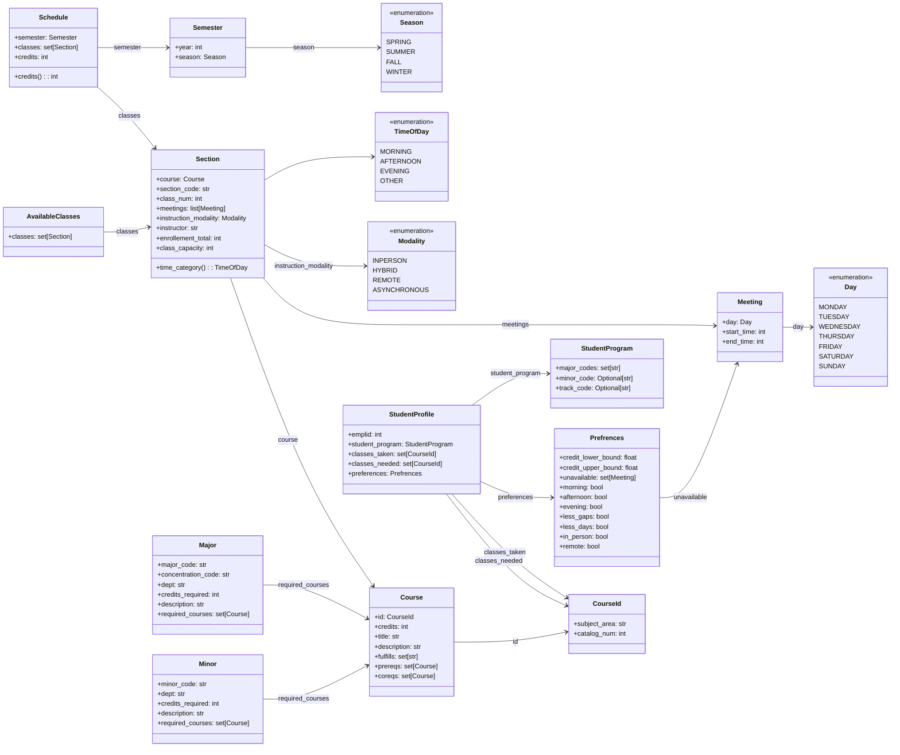

# Models Class Diagram

This diagram is auto-generated from `models.py`. Do not edit manually.

```mermaid
classDiagram
direction LR

class TimeOfDay {
  <<enumeration>>
  MORNING
  AFTERNOON
  EVENING
  OTHER
}

class Day {
  <<enumeration>>
  MONDAY
  TUESDAY
  WEDNESDAY
  THURSDAY
  FRIDAY
  SATURDAY
  SUNDAY
}

class Modality {
  <<enumeration>>
  INPERSON
  HYBRID
  REMOTE
  ASYNCHRONOUS
}

class Season {
  <<enumeration>>
  SPRING
  SUMMER
  FALL
  WINTER
}

class CourseId {
  +subject_area: str
  +catalog_num: int
}

class Meeting {
  +day: Day
  +start_time: int
  +end_time: int
}

class Prefrences {
  +credit_lower_bound: float
  +credit_upper_bound: float
  +unavailable: set[Meeting]
  +morning: bool
  +afternoon: bool
  +evening: bool
  +less_gaps: bool
  +less_days: bool
  +in_person: bool
  +remote: bool
}

class Course {
  +id: CourseId
  +credits: int
  +title: str
  +description: str
  +fulfills: set[str]
  +prereqs: set[Course]
  +coreqs: set[Course]
}

class Semester {
  +year: int
  +season: Season
}

class Section {
  +course: Course
  +section_code: str
  +class_num: int
  +meetings: list[Meeting]
  +instruction_modality: Modality
  +instructor: str
  +enrollement_total: int
  +class_capacity: int
  +time_category(): TimeOfDay
}

class StudentProgram {
  +major_codes: set[str]
  +minor_code: Optional[str]
  +track_code: Optional[str]
}

class Major {
  +major_code: str
  +concentration_code: str
  +dept: str
  +credits_required: int
  +description: str
  +required_courses: set[Course]
}

class Minor {
  +minor_code: str
  +dept: str
  +credits_required: int
  +description: str
  +required_courses: set[Course]
}

class StudentProfile {
  +emplid: int
  +student_program: StudentProgram
  +classes_taken: set[CourseId]
  +classes_needed: set[CourseId]
  +preferences: Prefrences
}

class AvailableClasses {
  +classes: set[Section]
}

class Schedule {
  +semester: Semester
  +classes: set[Section]
  +credits: int
  +credits(): int
}

AvailableClasses --> Section : classes
Course --> CourseId : id
Major --> Course : required_courses
Meeting --> Day : day
Minor --> Course : required_courses
Prefrences --> Meeting : unavailable
Schedule --> Section : classes
Schedule --> Semester : semester
Section --> Course : course
Section --> Meeting : meetings
Section --> Modality : instruction_modality
Section --> TimeOfDay
Semester --> Season : season
StudentProfile --> CourseId : classes_needed
StudentProfile --> CourseId : classes_taken
StudentProfile --> Prefrences : preferences
StudentProfile --> StudentProgram : student_program
```
