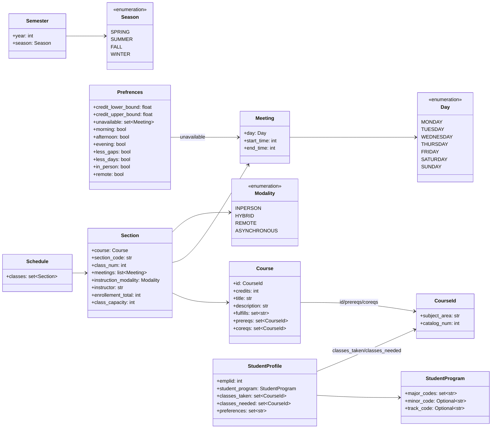

# Models Class Diagram

This diagram documents the Python domain model defined in `models.py`.

```mermaid
classDiagram
direction LR

class Day {
  <<enumeration>>
  MONDAY
  TUESDAY
  WEDNESDAY
  THURSDAY
  FRIDAY
  SATURDAY
  SUNDAY
}

class Modality {
  <<enumeration>>
  INPERSON
  HYBRID
  REMOTE
  ASYNCHRONOUS
}

class Season {
  <<enumeration>>
  SPRING
  SUMMER
  FALL
  WINTER
}

class CourseId {
  +subject_area: str
  +catalog_num: int
}

class Meeting {
  +day: Day
  +start_time: int
  +end_time: int
}

class Prefrences {
  +credit_lower_bound: float
  +credit_upper_bound: float
  +unavailable: set~Meeting~
  +morning: bool
  +afternoon: bool
  +evening: bool
  +less_gaps: bool
  +less_days: bool
  +in_person: bool
  +remote: bool
}

class Course {
  +id: CourseId
  +credits: int
  +title: str
  +description: str
  +fulfills: set~str~
  +prereqs: set~CourseId~
  +coreqs: set~CourseId~
}

class Semester {
  +year: int
  +season: Season
}

class Section {
  +course: Course
  +section_code: str
  +class_num: int
  +meetings: list~Meeting~
  +instruction_modality: Modality
  +instructor: str
  +enrollement_total: int
  +class_capacity: int
}

class StudentProgram {
  +major_codes: set~str~
  +minor_code: Optional~str~
  +track_code: Optional~str~
}

class StudentProfile {
  +emplid: int
  +student_program: StudentProgram
  +classes_taken: set~CourseId~
  +classes_needed: set~CourseId~
  +preferences: set~str~
}

class Schedule {
  +classes: set~Section~
}

Meeting --> Day
Prefrences --> Meeting : unavailable
Course --> CourseId : id/prereqs/coreqs
Section --> Course
Section --> Meeting
Section --> Modality
Semester --> Season
StudentProfile --> StudentProgram
StudentProfile --> CourseId : classes_taken/classes_needed
Schedule --> Section
```
